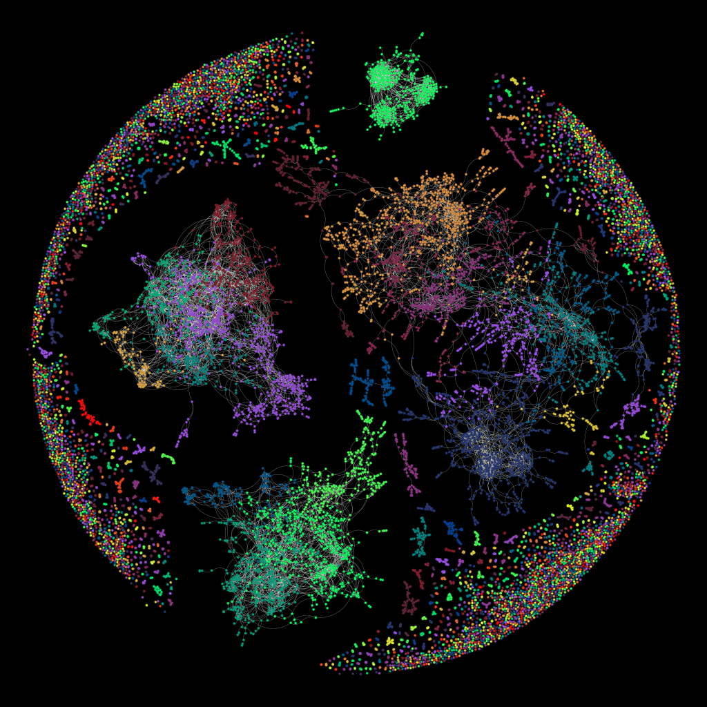
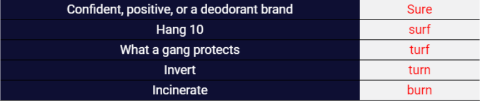
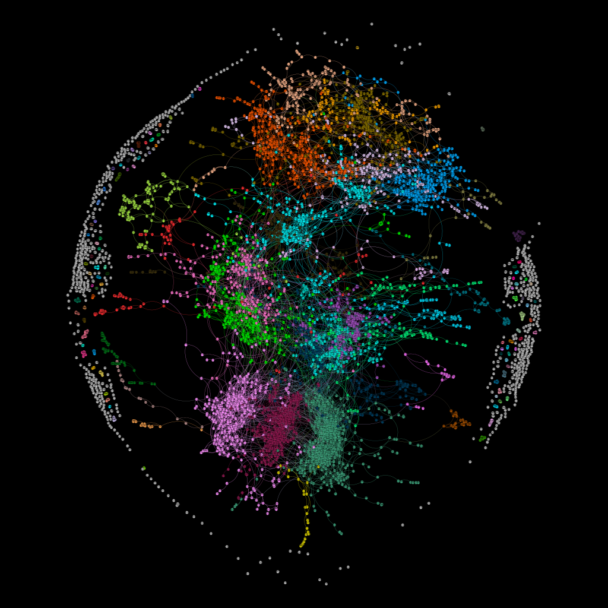
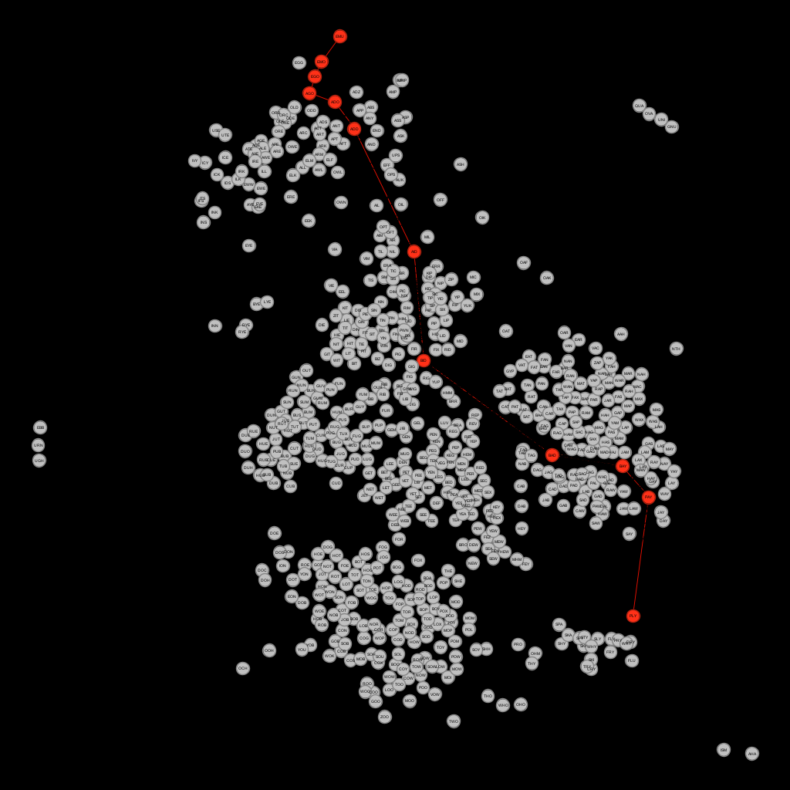
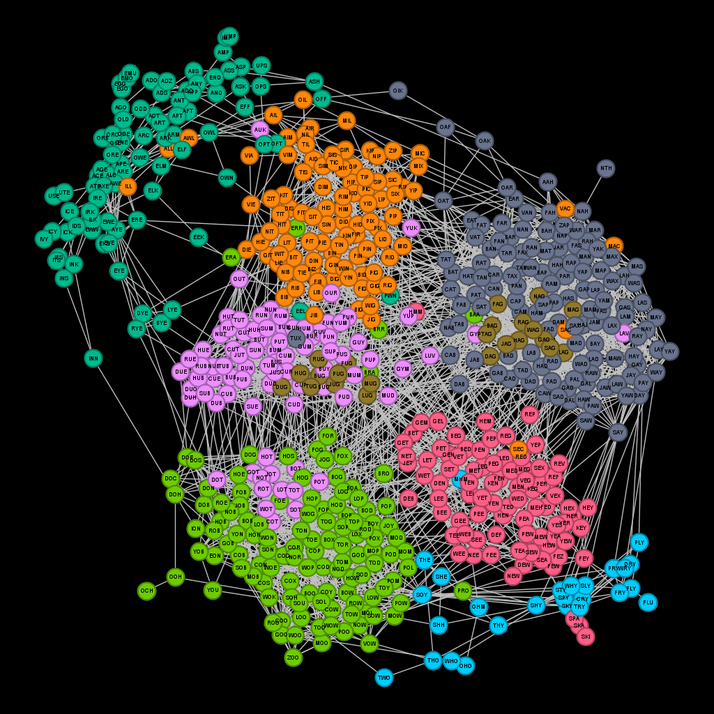
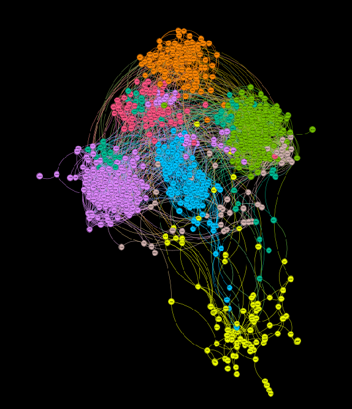
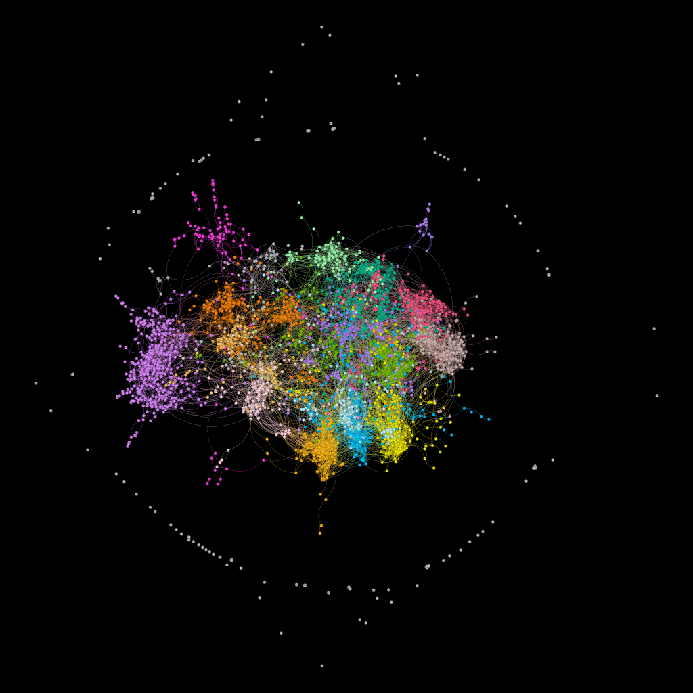
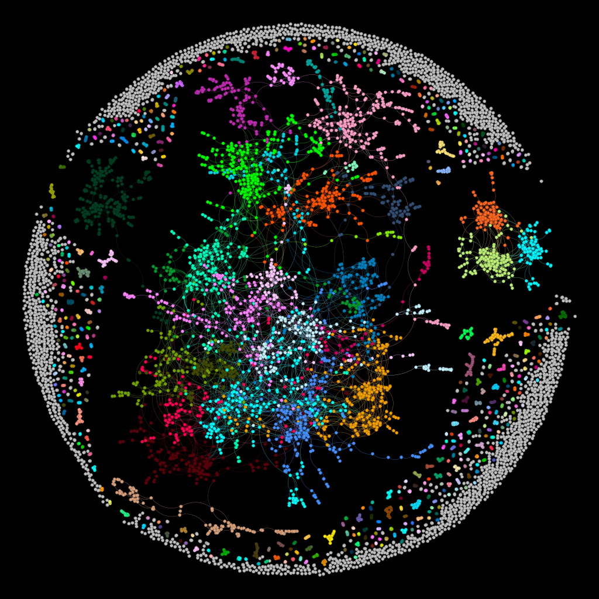
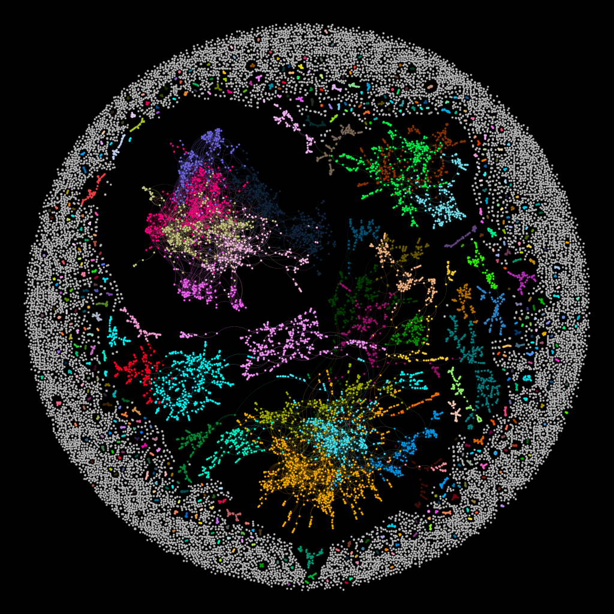

# Analyzing Connections in a Word Ladder Network Graph
## Project Overview
For anyone who's spent time on sites like [Sporcle](https://www.sporcle.com/games/subcategory/wordladder), you may have encountered word ladder quizzes. In these puzzles, you start with one word and transform it into another word by changing only one letter at a time, with each intermediate step also being a valid word.

Inspired by this idea, I decided to take on a data analysis project using word ladders to explore network theory. My goal was to build a word ladder network graph where each node is a word, and an edge connects two nodes if the words differ by just one letter.

## How to run the program

### Prerequisites
Make sure you have Python installed. Download it from [python.org](https://www.python.org/downloads/).

### Install Dependencies
Install the required libraries with the following command:

pip install networkx python-louvain

###  Running the Program
Double-click the run.bat file to start the program.
Enter the word length when prompted in the console.

###  Word Dictionary
You can choose between two dictionaries, set the desired dictionary in the script:

WORD_DICT = 'words_12dict.csv'  or 'words_scrabble.csv'

## Questions and Goals
Here are some of the key questions I aimed to answer:

### 1. Longest Shortest Path Between Words (Graph Diameter)
The **diameter** of a graph represents the longest of all shortest paths between pairs of nodes, indicating the maximum number of transformations needed to connect two words. This measure helps reveal the farthest "reachable" pairs in the network, giving insight into the network’s overall span.

### 2. Most Needed Intermediate Words (Betweenness Centrality)
Certain words may serve as crucial "bridges" within the network, connecting otherwise separate clusters of words. By measuring **betweenness centrality**, I identified words that frequently appear on the shortest paths between others. A high centrality score indicates that a word is essential in connecting different parts of the network.

### 3. Categories or Clusters Among the Words (Community Detection)
Visualizing the network often reveals clusters of related words, potentially based on themes, letter patterns, or parts of speech. Using **community detection** algorithms, I identified these clusters, which highlight commonalities and patterns within the network structure.

## Defining “Words” for the Network
Initially, I considered using a full Scrabble dictionary, but it was unwieldy, containing many rare or obscure words. I chose the 12Dicts word list, a manageable dataset of common words, allowing for faster computation and focusing on familiar English words. I wrote a script to filter this list, export it to a CSV file, and clean out unnecessary entries.

## Building the Graph Script
To build and analyze the word ladder network, I used **NetworkX** for core graph calculations, including shortest paths, betweenness centrality, and community detection.

To check if words differ by just one letter, I represented each word as a unique byte array, encoding each letter as a distinct byte within an integer. Using a set of possible binary one-letter transformations, I quickly verified one-letter differences with a time complexity of **O(n²)** and space complexity of **O(n)**.

**Example (Comparing "HAT" and "CAT"):**
1. **Convert** each word to hexadecimal values:
   - "CAT": `C = 0x02, A = 0x00, T = 0x130000` → Sum: `0x130002`
   - "HAT": `H = 0x07, A = 0x00, T = 0x130000` → Sum: `0x130007`
2. **XOR** the values: `0x130002 ^ 0x130007 = 0x000005`
3. **Interpret Result**: The XOR result `0x000005` shows a difference in only one byte, indicating a one-letter difference, which is confirmed by checking if `0x000005` is in `pairChecker`.

## Graph Analysis with NetworkX and Louvain
- **Shortest Path Calculation**: Using NetworkX, I calculated shortest paths to determine the network's diameter and identify central words.
- **Betweenness Centrality**: NetworkX’s `betweenness_centrality()` function highlighted important "bridge" words that connect clusters within the network.
- **Community Detection**: Using the **Louvain method**, I detected communities in the graph, revealing clusters of closely related words.

## Visualization with Gephi
The script exported the network data to Gephi for visualization. Below is an example of a 5-letter word network graph.

## Results and Insights

### Longest Shortest Path
Measuring the network’s diameter revealed that the longest shortest path between any two words was surprisingly large, suggesting some words are quite distant in terms of single-letter transformations.

**3-letter diameter path**: `PLY, PAY, BAY, BAD, BID, AID, ADD, ADO, AGO, EGO, EMO, EMU`

Below is the network Diameter for many of the word groups within the dataset.

| Word Length | Network Diameter |
|-------------|------------------|
| 3           | 11               |
| 4           | 16               |
| 5           | 29               |
| 6           | 13               |
| 7           | 43               |
| 8           | 10               |

### Key Intermediate Words
To identify the most important intermediates, we analyzed two factors: **node degree** (number of connections a word has) and **betweenness centrality** (frequency as a bridge between other words). Words like "AUDIO" and "HOUSE," which have high values in these measures, often contain vowels, making them versatile connectors in the network.

### Word Categories and Clusters
Using the Louvain method, I detected communities in the word network, revealing clusters of words with similar structures or sounds. Typically, words with shared consonant patterns or suffixes, like "-ing," formed distinct groups. For three-letter words, clustering often reflects the central vowel, as in groups formed by the middle letter.

--- 

This project provided deep insights into word connections and network theory while enhancing my data analysis skills with NetworkX, Louvain, and Gephi. 

---

## Remaining Images

### 12Dict Dataset

#### 3 Letter Words

#### 4 Letter Words

#### 5 Letter Words

#### 6 Letter Words

### Scrabble Dataset

#### 5 Letter Words

#### 6 Letter Words

